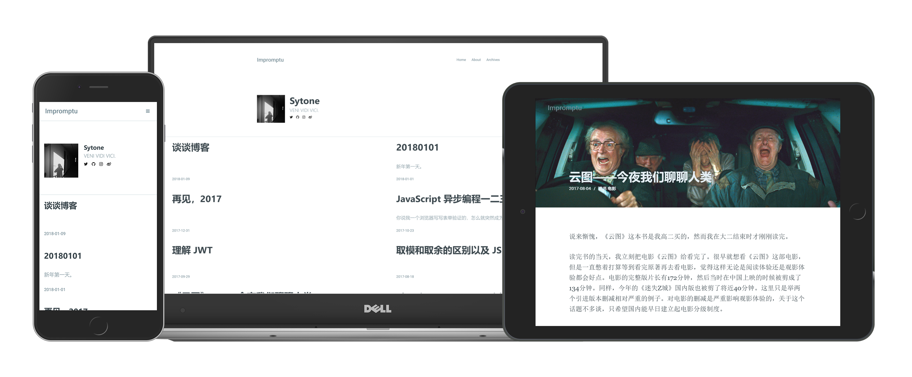

# Impromptu

Yet another concise and clean theme for hexo.



## Getting started

1. Install

``` bash
cd your-blog
git clone https://github.com/clarkzsd/hexo-theme-impromptu themes/impromptu
```

2. Enable theme

   Update `theme` option in `your-blog/_config.yml`:

``` yaml
theme: impromptu
```

## Configuration

### Theme configuration

`themes/improptu/_config.yml`

```yaml
# Header：
# Navigation menu
menu:
  Home: /
  About: /about
  Archives: /archives

# Social links:
# Will be displayed as icons in the profile area
social:
  twitter: https://twitter.com/
  github: https://github.com/
  instagram: https://twitter.com/
  weibo: https://weibo.com/

# Keyword for SEO
keyword: Sytone's Blog

# favicon filename(path: ./source/img/)
favicon: favicon.ico

# Author profile
author: Sytone
# avatar filename(path: ./source/img/)
avatar: avatar.png
bio: VENI VIDI VICI.

# Disqus:
# Your disqus shortname to enable disqus
disqus_shortname: 

# Gitment:
# Your gitment related options to enable gitment
gitment:
  owner:
  repo:
  client:
    id:
    secret:
```

**Note:** 

* Put your favicon and avatar in `themes/impromptu/source/img/`

### Post configuration

``` markdown
---
title: 
date: 
tags: 
categories: 
description: 
image:
---

...
```

* `description`: The description blow the post title. Word limit: 120 words.
* `image`: The url of image. Will be displayed as a cover image of the post. Preview:


## Update

``` bash
cd themes/impromptu
git pull
```


## Development

``` bash
cd themes/impromptu

npm install

# devlopment mode with hexo server(serve at localhost:4000)
npm run start

# build for production
npm run build
```

## License

MIT	

